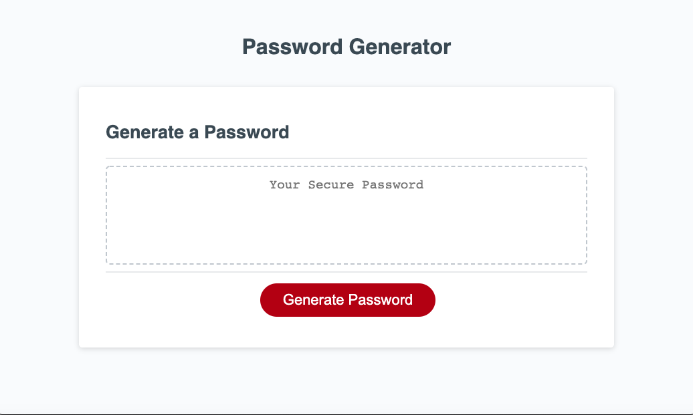

# Pws-Generator-AK

## Description
This is an application that generates a random password based on user-selected criteria. Once the application validates the user inputs, the user will be presented with a password matching the answered prompts. The application is also responsive, ensuring that it adapt to multiple screen sizes.

## Instructions

Create an application that generates a random password based on user-selected criteria. This app will run in the browser and feature dynamically updated HTML and CSS powered by your JavaScript code. The user will be prompted to choose from the following password criteria:

Length (must be between 8 and 128 characters)
Character type:
Special characters
Numeric characters
Lowercase characters
Uppercase characters

## Web Link 
Visit deplyed project at: https://aken00.github.io/Pws-Generator-AK/

